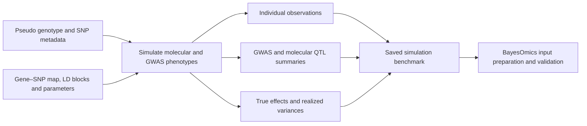
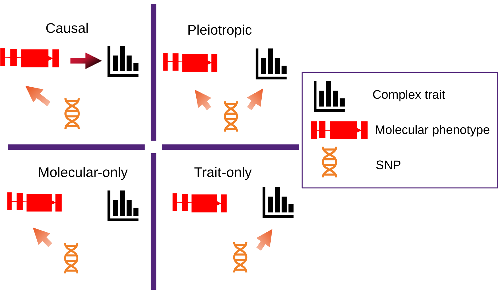

# SBayesOmics

**Simulation of GWAS and molecular QTL data with known genetic effects.**

SBayesOmics is the R simulation companion to
[BayesOmics](https://github.com/ShouyeLiu/BayesOmics). It constructs phenotypes,
GWAS and molecular QTL summary statistics, and genetic-effect truth from
specified genotype and gene–SNP configurations. Saving these together makes it
possible to evaluate downstream software against the same simulated dataset.

This README documents the simulation workflow under development. Examples use
1KG or pseudo genotypes. The simulation interface and data distribution are
being finalized; this release candidate and the current GitHub release
are not yet interchangeable. Downstream model fitting belongs to the BayesOmics
workflow and is outside the scope of this guide.

## Simulation workflow



The diagram describes the data flow, not measured performance.

## Installation

```r
install.packages("remotes")  # Once, if needed
remotes::install_github("ShouyeLiu/SBayesOmics")
library(SBayesOmics)
```


## Simulation models



The framework illustrates four simulation components: causal, pleiotropic,
molecular-only and trait-only. The component codes used by the simulator are
listed below.

The main entry point is `simGWASMainOverlap()`. Its `simModel` argument selects
components using the following letters; combinations such as `"ab"` and
`"abcd"` are supported by the selector.

| Code | Component | Meaning |
| --- | --- | --- |
| `a` | Causal molecular component | Molecular genetic effects contribute to the GWAS effect through gene effects. |
| `b` | Pleiotropic component | Selected variants affect both the molecular phenotype and the GWAS trait through separately generated effects. |
| `c` | Non-molecular component | GWAS effects outside the selected molecular component. |
| `d` | Null molecular component | Molecules have cis-genetic effects without a corresponding causal gene effect on the GWAS trait. |

For continuous traits, the generator constructs molecular phenotypes from
cis-genetic values plus residual noise and constructs the GWAS phenotype from
its total SNP genetic value plus residual noise. In the causal component,
`alphaTrue` and `thetaTrue` determine the mediated SNP contribution to
`betaTrue`. Molecular residual noise is not itself added to the GWAS genetic
value.

For a pure causal model (`simModel = "a"`), the implementation sets `h2med` equal
to `h2snp`. Without component `a`, it sets `h2med` to zero. Do not interpret an
incompatible supplied value as an independently achieved simulation target.

## Required inputs

| Input | Format and role |
| --- | --- |
| `trainBfile` | PLINK prefix without an extension; matching `.bed`, `.bim` and `.fam` files are required when `realGeno = TRUE`. |
| `mapSnpGeneAcrossChrFile` | RDS list containing `mapGene2Snp`, `mapSnp2Gene` and the positional information used to select molecular regions. Use a prepared map, not a two-column text file substituted for this object. |
| `mapLd2SnpFile` | RDS table connecting SNP metadata with LD blocks. SNP identifiers must agree with the genotype and gene map. |

`realGeno = TRUE` means **read the supplied BED genotypes**. It also applies to
saved pseudo genotypes. `realGeno = FALSE` instead generates dosage values
inside the simulator; it does not reuse the saved pseudo BED realization.

Keep sample order, SNP identifiers, alleles, genome build and genomic windows
consistent. A cis window of ±50 kb describes the configuration, not the number
of simulated individuals.

## Example: simulate a continuous causal trait from saved pseudo genotypes

This example uses the bundled pseudo inputs for chromosome 22 blocks
582–585. It generates a new realization only if the named saved object is
absent. To inspect an existing benchmark, use `readRDS()` directly instead.

```r
# Install and load the package first.
param_dir <- system.file("extdata/params", package = "SBayesOmics", mustWork = TRUE)
stem <- "lbs582_585_1kg-cis-50000-gene-gwas-chr22-"
bfile <- file.path(system.file("extdata/genotype", package = "SBayesOmics",
                               mustWork = TRUE), "pseudo-1kg-p3-EUR-HM3-chr22")
gene_map <- file.path(param_dir, paste0(stem, "snp-2-gene-map.rds"))
ld_map <- file.path(param_dir, paste0(stem, "ld-2-snp-map.rds"))
input_files <- c(paste0(bfile, c(".bed", ".bim", ".fam")), gene_map, ld_map)
stopifnot(all(file.exists(input_files)))

config <- list(
  isIndLevelBool = TRUE,
  seed = 20260914,
  trainBfile = bfile,
  mapSnpGeneAcrossChrFile = gene_map,
  mapLd2SnpFile = ld_map,
  simModel = "a",
  geneOverlap = "a",
  traitType = "a",
  indNum = 0,                  # Use all individuals in the supplied BED
  NumCGCau = 12,
  NumCVPerGCau = 3,
  realGeno = TRUE,
  calcLDBlool = FALSE,         # Development spelling; keep it exactly
  h2cis = 0.5,
  h2snp = 0.5,
  h2med = 0.5,
  outPath = "",
  smrPath = ""
)

output_dir <- "simulation/pseudo-causal-example"
dir.create(output_dir, recursive = TRUE, showWarnings = FALSE)
output_file <- file.path(output_dir, "simulation.rds")
fingerprint <- tools::md5sum(input_files)
version <- as.character(packageVersion("SBayesOmics"))

if (file.exists(output_file)) {
  saved <- readRDS(output_file)
  stopifnot(identical(saved$config, config),
            identical(saved$fingerprint, fingerprint),
            identical(saved$version, version))
  sim <- saved$simulation
} else {
  sim <- do.call(simGWASMainOverlap, config)
  saveRDS(list(simulation = sim, config = config,
               fingerprint = fingerprint, version = version, session = sessionInfo()),
          output_file)
}
```

The `calcLDBlool` argument in this candidate is not part of the older public function
signature. Check `formals(simGWASMainOverlap)` when using a different version.
This example disables LD calculation inside the generator; LD can be prepared
separately from the same saved genotypes.

Gene selection can return a subset of the configured SNPs. In particular, a
pure causal realization does not automatically retain every background SNP in
the four-block configuration. The prepared four-block benchmark additionally
retains background SNPs with zero true effects; its dimensions must not be
assumed for every fresh simulator call.

## Main parameters

| Argument | Meaning |
| --- | --- |
| `seed` | Random seed; keep a positive fixed value and save it with the data. |
| `indNum` | Number of individuals selected from the BED input; `0` uses all available individuals in the development BED-reading path. |
| `isIndLevelBool` | Retain individual genotype and phenotype matrices when `TRUE`; otherwise return summary-oriented objects. |
| `traitType` | `"a"` selects the continuous-trait workflow documented here. Binary-trait branches require separate validation and are not covered by this example. |
| `geneOverlap` | `"a"`: non-overlap selection; `"b"`: overlap-oriented selection; `"c"`: random gene selection. Feasibility depends on the supplied map. |
| `NumCGCau`, `NumCVPerGCau` | Number of causal molecules and active cis variants per causal molecule. |
| `NumCGPle`, `NumCVPerGPle` | Corresponding counts for the pleiotropic component. |
| `NumCGNull`, `NumCVPerGNull` | Corresponding counts for null molecular components. |
| `NumCVIG` | Number of active variants for component `c`. |
| `isVaryCaus` | Vary active-variant counts; the non-overlap and overlap-oriented selectors do not support this option. |
| `h2cis` | Target molecular cis heritability used to set residual-noise variance. |
| `h2snp` | Target total SNP heritability for the continuous GWAS trait. |
| `h2med` | Mediated component setting; subject to the component-specific rules above. |
| `ldwBool` | Select blockwise LD handling when LD calculation is enabled. |
| `outPath` | Retained in the function signature; the public simulator does not write RDS files. Save the returned object explicitly with `saveRDS()`. |
| `smrPath`, `smrIndGenePath`, `smrIndFileSuffix` | Retained arguments; the public simulator does not export downstream input files. |

Advanced overlap switches remain implementation-specific. Inspect
`formals()` and the simulation source before changing them; the example does
not depend on their experimental combinations.

## Returned data and simulation truth

The return value is a list. Some fields are conditional on the selected model,
individual-output setting or LD calculation.

| Fields | Contents |
| --- | --- |
| `X`, `y` | Model-scale genotype matrix and GWAS phenotype, retained for individual output. |
| `Z`, `eMatrix` | Molecular genotype subset and molecular phenotypes for models containing molecules. |
| `betaTrue` | Total true GWAS SNP effects on the simulator's genotype scale. |
| `alphaTrue`, `thetaTrue` | True molecular SNP effects and gene effects. Match rows and columns by identifiers. |
| `bhat`, `bhatSE` | GWAS marginal regression estimates and standard errors on the model genotype scale. |
| `AMargin`, `AMarginSE` | Molecular marginal estimates and standard errors. |
| `bhatSMR`, `bhatSESMR`, `AMarginSMR`, `AMarginSESMR` | Export-oriented effect scales; do not interchange these with internal effects without checking genotype scaling. |
| `RBlocks`, `UBlocks`, `lambdaBlocks` | Block LD and its decomposition when calculated. |
| `Rgene`, `Ugene`, `lambdaGene` | Molecular LD objects when calculated. |
| `vary`, `varGene`, `nGWAS`, `neQTLs` | Phenotype variances and sample-size information. |
| `genelistForModel`, `snplistMapForModel` | Selected model components and molecular variant assignments. |

Requested heritabilities are design settings. The realized variance ratio in a
finite simulated sample need not equal its target exactly. For example, inspect
realized SNP heritability using the saved individual data:

```r
beta <- sim$betaTrue[match(colnames(sim$X), rownames(sim$betaTrue)), , drop = FALSE]
stopifnot(!anyNA(beta))
genetic_value <- drop(sim$X %*% beta)
realized_h2snp <- var(genetic_value) / var(drop(sim$y))
c(target = sim$h2snp, realized = realized_h2snp)
```

This is a simulation-truth calculation, not a fitted heritability estimate.
Preserve both target settings and realized quantities for downstream comparisons.

## Saving and reusing a benchmark

Save the complete simulation object once, together with its configuration, seed,
input checksums and R session information. Reuse that object for summaries,
plots, format conversion and repeated software comparisons. Do not regenerate
phenotypes merely to export another input format.

Keep the genotype scaling and ordered sample/SNP/gene identifiers alongside the
truth. Marginal slopes are not the same as genotype–phenotype cross-products;
correlation LD is not automatically covariance LD. Exporters must preserve the
corresponding conventions rather than change the simulated effects.

## Preparing BayesOmics C++ inputs

Use the same saved realization for individual and summary input preparation.
The C++ data-management workflow handles LD references and molecular summary
conversion. The relevant input families are:

| Input family | Data to retain/export |
| --- | --- |
| Individual GWAS | PLINK genotype, FID/IID phenotype file and sample/SNP order. |
| Individual molecules | Molecular phenotype files, phenotype manifest and exact gene–SNP pairs. |
| GWAS summary | SNP, effect/non-effect alleles, allele frequency, beta, SE, P value and N (`.ma`). |
| Molecular summary | Gene/SNP metadata, alleles, frequency, beta, SE, P value and N (`.query.gz`), or ESD/flist for conversion. |
| LD reference | Block definitions and matching block/molecular LD, with SNP order and allele orientation. |
| Truth and provenance | Original effects, realized variances, genotype scales, seeds and input/version checksums. |

Downstream exporters must be implemented separately and checked against the C++
input contracts, including headers and relative phenotype paths. Writing
an RDS file is not itself a completed C++ input export. See the
[BayesOmics documentation](https://shouyeliu.github.io/softwares/content-softwares.html)
for the downstream data-management workflow.


## Citation and contact

For the associated SBayesCO-EIEO study, see
[*Joint Bayesian modelling of molecular QTL and GWAS effects improves polygenic
prediction for complex traits*](https://www.medrxiv.org/content/10.64898/2026.03.10.26347908v1),
medRxiv preprint, 2026, DOI: **10.64898/2026.03.10.26347908**.
Please also record the SBayesOmics version or source revision used to generate
your simulation. The citation does not establish validation of every simulation
option or development extension.

Questions and bug reports: [GitHub Issues](https://github.com/ShouyeLiu/SBayesOmics/issues).
Maintainer: Shouye Liu, [shouye.liu@uq.edu.au](mailto:shouye.liu@uq.edu.au).
License: GPL (>= 3).
